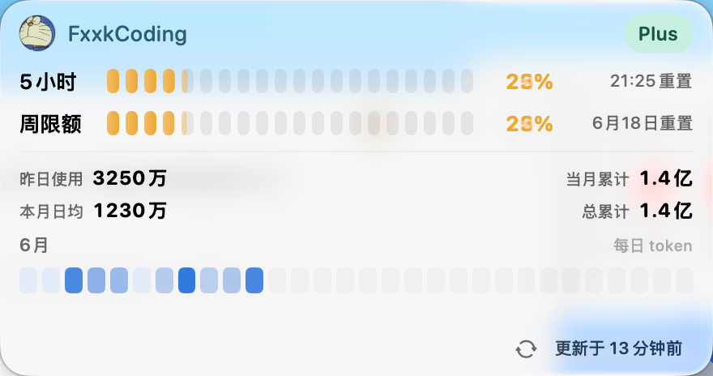

# CodexBar

[English](#english) | [中文](#中文)



## English

CodexBar is a native macOS menu bar app for Apple Silicon. It shows your Codex
quota and token usage in a compact liquid-glass panel, using the local Codex
login stored by the Codex app or CLI.

### Features

- Menu bar icon with the current 5-hour quota percentage.
- Anchored macOS-style panel with avatar, username, and subscription tier.
- Segmented quota bars for the 5-hour limit and weekly limit.
- Reset time display for each quota window.
- Available reset credit count with a hover table for grant and expiry times.
- Plan badge hover popover with subscription expiry and renewal times.
- Monthly token heatmap with instant hover tooltips.
- Usage summary for yesterday, this month's daily average, monthly total, and
  all-time total.
- Manual refresh button with a smooth refresh-time transition.
- Configurable background refresh interval: 1, 5, 15, or 30 minutes.
- Token usage notifications after Codex responses, plus quota reset reminder
  notifications.
- Right-click menu bar icon to toggle notifications or quit.

CodexBar reads local Codex authentication data and refreshes tokens when needed.
If the panel reports an auth error, run `codex login` or sign in with the Codex
app, then open CodexBar again.

### Build

Build the app:

```bash
scripts/build-app.sh
```

The packaged app is written to:

```text
dist/CodexBar.app
```

Run it with:

```bash
open dist/CodexBar.app
```

Build a release DMG:

```bash
scripts/build-dmg.sh 1.2.1
```

The DMG is written to:

```text
release/CodexBar-1.2.1-arm64.dmg
```

## 中文

CodexBar 是一个原生 macOS 菜单栏应用，仅支持 Apple Silicon。它会读取本地
Codex 登录信息，在菜单栏展示 Codex 额度，并通过一个紧凑的 liquid-glass 面板
展示额度、重置时间和 token 使用情况。

### 功能

- 菜单栏图标展示当前 5 小时额度百分比。
- 点击菜单栏图标弹出吸附式面板，展示头像、用户名和订阅等级。
- 用分段色块展示 5 小时额度和周限额。
- 显示每个额度窗口的重置时间。
- 显示剩余可用重置次数，鼠标悬停可查看每个重置额度的发放时间和过期时间。
- 套餐标签支持悬停查看订阅过期时间和续费时间。
- 展示当月 token 使用热力图，鼠标划过色块会立即显示当日用量。
- 展示昨日使用、本月日均、当月累计和总累计 token。
- 支持手动刷新，并带有刷新时间的渐隐切换。
- 支持设置后台刷新间隔：1、5、15、30 分钟。
- 支持 Codex 回答完成后的 token 用量通知，以及额度重置提醒通知。
- 右键菜单栏图标可以开关通知或退出应用。

CodexBar 会复用本地 Codex 的登录状态，并在需要时刷新 token。如果面板提示认证
错误，请先执行 `codex login`，或打开 Codex app 登录后再重新打开 CodexBar。

### 构建

构建 app：

```bash
scripts/build-app.sh
```

构建产物位置：

```text
dist/CodexBar.app
```

运行 app：

```bash
open dist/CodexBar.app
```

构建发布用 DMG：

```bash
scripts/build-dmg.sh 1.2.1
```

DMG 输出位置：

```text
release/CodexBar-1.2.1-arm64.dmg
```
